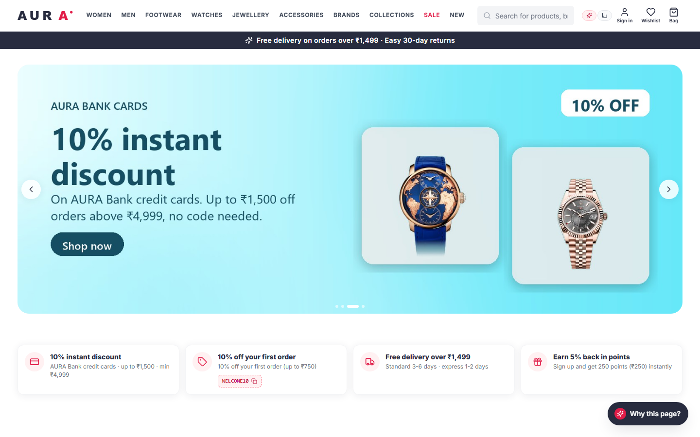
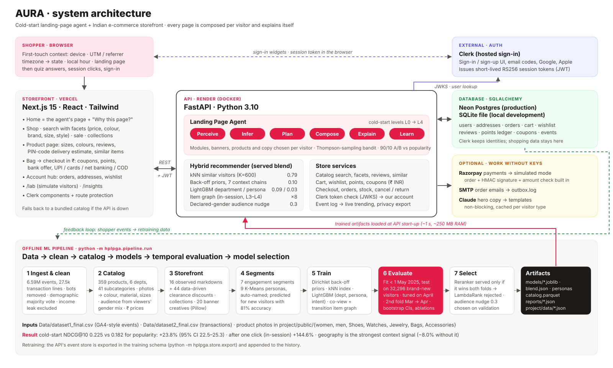
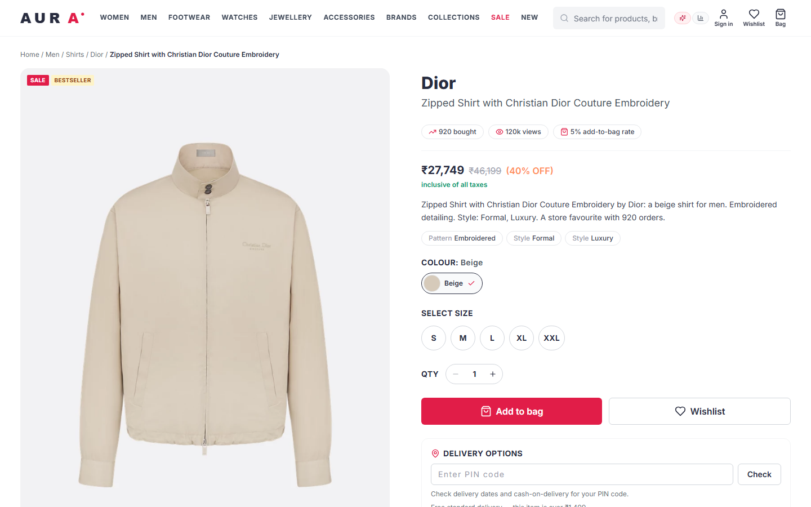
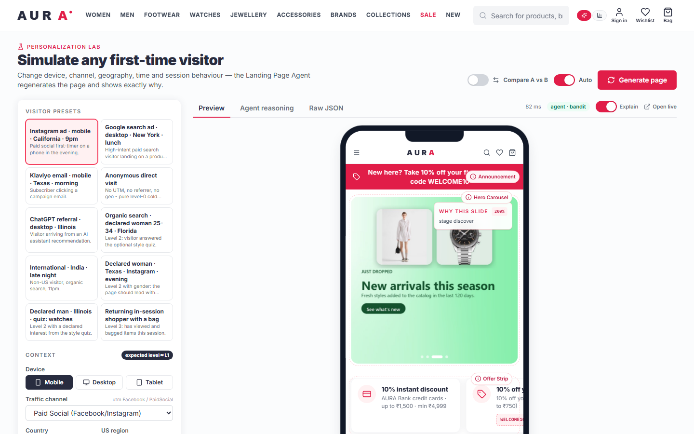
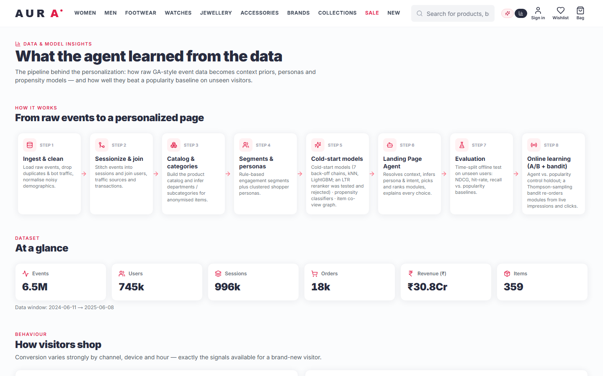
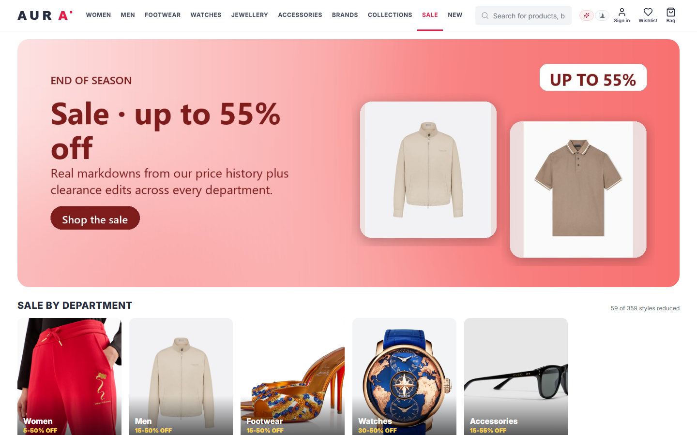
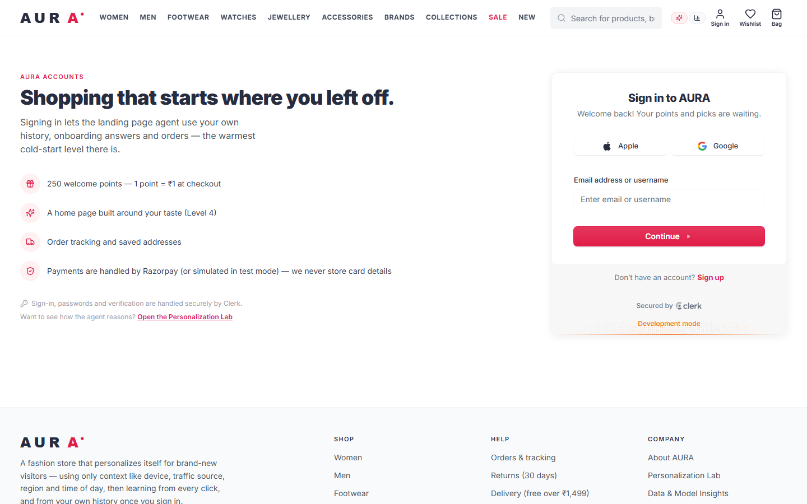
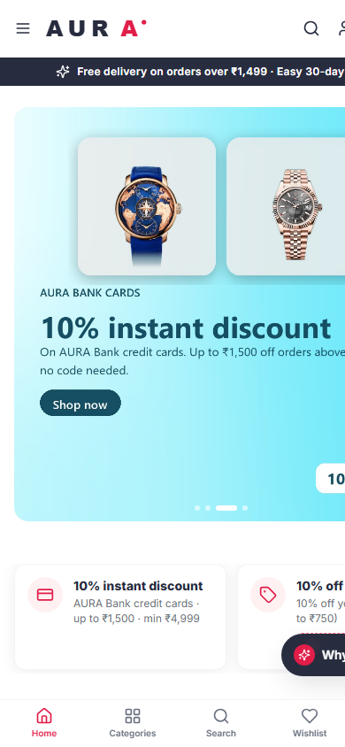

# AURA · Hyper-Personalized Landing Page Generator Agent

NetElixir **AIgnition 2.0** challenge. An AI agent that builds a personalized landing page for **first-time / guest visitors** (the
cold-start problem) of a fashion e-commerce store. It keeps personalizing as the visitor browses, answers a short quiz, signs in and
orders. Everything is learned from the two provided datasets only: 6.59M GA4-style events and 27.5k transaction lines.



| Surface | What it does |
|---|---|
| **Storefront** (Next.js, Indian store in ₹) | A complete Myntra/AJIO-style store.<br>**Catalog:** 359 products in 6 departments and 41 subcategories, plus brands, collections and a sale page.<br>**Search:** server-side, with filters for price, colour, brand, size, style, material, pattern and rating.<br>**Product pages:** description, colour and size options, stock per size, PIN-code delivery estimate, written and star reviews, similar products.<br>**Account:** wishlist and bag synced to the account; Clerk sign-in (email codes, Google, Apple); onboarding; profile hub with orders, addresses, settings, offers, points and privacy export/delete.<br>**Checkout:** 3 steps, with coupons, a bank offer, loyalty points and UPI, credit card, debit card, net banking, wallet or cash on delivery. Orders can be tracked, cancelled and returned. |
| **Generated home page** | The agent chooses and orders every module for the visitor: hero creatives, offer strip, category grid, carousels, bundles, deals and call-to-action. A **"Why this page?"** drawer explains every decision. |
| **Personalization Lab** `/lab` | Simulate any visitor: device, source, region, hour, age, gender, quiz interest or session.<br>Preview the result in a phone or desktop frame and compare two visitors side by side.<br>A built-in check shows how the page reacts to gender and location. |
| **Insights** `/insights` | Shows the data cleaning, funnel, channels, segments and personas.<br>Shows how the models scored offline against the baselines, what each signal adds, what changes the page, and the evidence behind each model choice.<br>Shows the live A/B test and the bandit's current state. |
| **API** (FastAPI) | `POST /api/v1/landing-page` returns the page layout as JSON, with a reason on every module and product.<br>Also covers accounts, catalog, checkout, orders and experiments ([API contract](ecomm_personalization/docs/API_CONTRACT.md)). |

---

## 1. Architecture



- **Offline pipeline** (`python -m hplpga.pipeline.run`).
  - Cleans the raw data, builds the catalog and storefront content, and trains the cold-start models.
  - Evaluates them on a held-out month of genuinely new visitors.
  - Picks the model to serve by a fixed rule: a candidate must win on both evaluation folds.
- **API** (FastAPI, Docker on Render).
  - Loads the trained files in about 1 second and uses about 250 MB of RAM.
  - Runs the six-step Landing Page Agent and the store services.
  - Verifies Clerk login tokens against Clerk's public keys (JWKS) and links each Clerk user to an account in our database.
- **Storefront** (Next.js 15 on Vercel).
  - Renders the agent's page.
  - Sends each signed-in shopper's Clerk session token with every API call.
- **Database** (SQLAlchemy). SQLite locally, Neon Postgres in production. Orders, points, wishlists, reviews and behaviour events live there.
  - The event log is exported in the training schema (`python -m hplpga.store.export`), which closes the retraining loop.
- **Optional services** (Razorpay payments, SMTP email, Claude-written hero copy). Each switches on with a key and falls back safely without one:
  - payments → simulated mode;
  - emails → `outbox.log`;
  - hero copy → templates.

## 2. Results (temporal hold-out on genuinely new visitors)

**How it was tested**
- Models are trained only on data from **before 2025-05-01**.
- They are tested on the **32,296 visitors first seen between 2025-05-01 and 2025-06-08** who interacted with at least one catalog item.
- Only first-touch context is revealed. The ground truth is every item the visitor viewed, added to the bag or bought.
- All weights were tuned on the previous month (April).
- A second fold (tune on March, test on April) checks robustness.
- Every number below comes from `backend/artifacts/reports/evaluation.json`, which `/insights` also displays.

**Cold start, first page view, K = 10**

| Model | NDCG@10 | HitRate@10 | Recall@10 | Catalog coverage | vs popularity |
|---|---|---|---|---|---|
| Random | 0.015 | 0.042 | 0.030 | 100% | −92% |
| Global popularity (classic fallback) | 0.182 | 0.341 | 0.279 | 3% | – |
| Trending (time-decayed) | 0.168 | 0.316 | 0.251 | 3% | −7.3% |
| LightGBM department affinity | 0.177 | 0.330 | 0.266 | 13% | −2.6% |
| LightGBM persona item mix | 0.199 | 0.380 | 0.313 | 12% | +9.8% |
| Context back-off priors (7 chains) | 0.208 | 0.400 | 0.331 | 42% | +14.6% |
| kNN similar visitors (K = 600) | 0.223 | 0.422 | 0.351 | 33% | +23.1% |
| **Hybrid blend, context only** | **0.224** | **0.425** | **0.354** | 33% | **+23.6%** |
| **Hybrid blend + declared demographics (served)** | **0.225** | **0.426** | **0.355** | 34% | **+23.8%** (95% CI 22.5 to 25.3) |
| Hybrid + LambdaRank reranker (rejected, §7) | 0.220 | 0.417 | 0.346 | 31% | +21.4% |
| Hybrid + hard gender filter (rejected, §7) | 0.205 | 0.383 | 0.314 | 29% | +12.8% |

**After one click (in-session).** Once the visitor has viewed one item, the item graph (co-views plus next-item transitions) inside the blend reaches NDCG **0.449** and HitRate **0.79**: **+144.6%** vs popularity.

**What each signal adds.** Removing one group from the served blend changes NDCG by:
- geography **−8.0%**
- kNN similar visitors **−7.6%**
- traffic source −0.3%
- back-off priors −0.2%
- LightGBM department/persona −0.1%
- time of day/season 0.0%

**What moves the page.** How many of the top 10 items change when one signal changes, measured on 400 test visitors:
- channel: 8.2
- declaring female: 8.7, and the share of women's-audience items goes from 23% to 100% with the full filter
- declaring male: 5.8
- region: 5.1
- device: 4.9
- time of day: 3.2

**Declared gender.**
- For the 2,398 test visitors whose data says female, NDCG goes from 0.227 (context only) to **0.240** once gender is declared (**+5.9%**).
- For male visitors, who are 93% of the test set, it is flat: 0.220 → 0.219.

**Classifiers on new visitors.**

| Prediction | Score (context only) | Score (with demographics) | Baseline |
|---|---|---|---|
| Add-to-cart propensity (ROC-AUC) | 0.85 | 0.87 | 0.50 |
| Purchase propensity (ROC-AUC) | 0.82 | 0.95 | 0.50 |
| Persona, 9 classes (accuracy) | 0.81 | – | 0.35 |
| Department, 6 classes (accuracy) | 0.54 | – | 0.54 |

Context alone barely predicts the department, which is why the agent switches to observed behaviour as soon as the visitor clicks.

**Robustness fold (March → April).**

| Model | NDCG@10 |
|---|---|
| Popularity | 0.198 |
| Back-off priors | 0.228 |
| kNN similar visitors | 0.238 |
| Hybrid blend | 0.238 (+19.8%) |

Serving takes about 40–60 ms per page on a warm laptop CPU.

## 3. Screens

| Agent-built home page | Product page |
|---|---|
|  |  |
| **Personalization Lab** | **Insights** |
|  |  |
| **Sale (data-driven discounts)** | **Clerk sign-in** |
|  |  |



## 4. Data engineering (`backend/hplpga/pipeline/ingest.py`, `catalog.py`, `storefront.py`, `banners.py`)

| Step | What was done |
|---|---|
| Load | 6.59M events, loaded with multi-threaded pyarrow in about 2 s. Transforms work on category codes, so no 15 GB string blow-ups. |
| Channels & geo | GA4 default channel grouping on (source, medium), plus an *AI Assistant* channel (e.g. chatgpt.com). Geography is grouped as state → US census region → country. |
| Bots | 26 visitors removed (more than 1,500 events in total, or more than 400 in one session). |
| Demographic noise | Gender and age vary **row to row** for the same visitor (66.6% and 92.4% of visitors have conflicting values), so each visitor gets a majority vote. |
| **Leak found** | `income_group` is missing on *every* row of *every* purchaser (99.97% of visitors with unknown income buy), so it is excluded from all models. |
| Item IDs | `page_view` product paths use a synthetic ITEM377–500 range that never appears in transactions. Only `view_item`, `add_to_cart` and purchases carry item signals. |
| Sessions | A 30-minute rule gives 996k sessions, matching the 996k `session_start` events. Each session is labelled bouncer, browser, product explorer, cart abandoner or converter. |
| Join | Purchase events are joined to transaction lines by `transaction_id`, with a **99.89%** match. |
| Catalog | 356 dataset items plus 3 catalog-only items (photos with no behaviour yet, i.e. item cold start) = **359 products** in 6 departments and 41 subcategories.<br>120 items that were viewed but never sold get a category by a kNN vote on the session co-view graph.<br>Prices are transaction medians, converted to ₹ at 84 per USD and rounded to retail endings.<br>Colour, material, pattern, style, sizes and the description come from the product name and photo.<br>Each item gets an `audience` (women, men or unisex) from its photo folder and the *real* gender mix of its viewers. |
| Discounts | Never typed in by hand:<br>(1) **16 observed markdowns**: the recent price is at least 7% below the item's reference price;<br>(2) **44 data-driven clearance discounts**: at least 150 views and an add-to-cart rate in the bottom quartile of the department give 20–50% off, scaled by how far conversion falls short;<br>(3) each department's "up to X% off" range is computed from those.<br>59 of the 359 styles are reduced. |
| Creatives | 20 campaign banners (wide and square), rendered with Pillow from the catalog's own product photos. Each carries targeting metadata (department, stage, season, channel, age) so the agent can choose among them. |

## 5. Segmentation (`segments.py`)

- **Engagement segments (rules).** Repeat purchasers, one-time purchasers, cart abandoners (8.3%), frequent viewers, window shoppers (39.4%), casual browsers and bouncers.
- **Personas (K-Means, k = 9, highest silhouette 0.29 for k from 5 to 9).**
  - Built on visit depth, intent, value, the mix across the 6 departments, device and channel.
  - Named automatically, e.g. *Direct Cart Hesitators*, *Womenswear Decisive Buyers*, *Search-Led Menswear Window Shoppers*.
  - A brand-new visitor's persona is predicted from first-touch context with 81% accuracy.

## 6. Cold-start strategy (`train.py`, `engine/recommender.py`) and the agent (`engine/agent.py`)

The agent climbs a five-level ladder:

| Level | Knows | Main signals |
|---|---|---|
| 0 Anonymous | nothing | global and time-decayed trends |
| 1 Contextual | device, channel/UTM/referrer, region (or timezone), time, landing page, season | back-off priors, kNN, LightGBM |
| 2 Declared | age, gender and interest from the style quiz or onboarding | adds the demographic × geo chain, gender-boosted kNN, P(department \| gender) and the audience nudge |
| 3 In-session | items viewed or bagged in this visit | adds the item graph (co-views plus next-item transitions) and the session's department mix |
| 4 Returning customer | own history and orders (signed in, or a known `visitorId`) | adds history to the graph, "Recently viewed" and "Goes with your purchase"; items already bought are excluded |

The score for each item is a weighted sum of components, each a probability distribution over the catalog. The served weights, tuned on April, are in `artifacts/models/blend.json`:

- **kNN similar visitors (0.79).** Context is one-hot encoded and weighted by mutual information. It uses the K = 600 nearest of 150k recent visitors, with gender weighted ×3 when declared.
- **Back-off priors (0.10).** P(item | cell) over 7 hierarchical chains with recursive Dirichlet smoothing (α = 10), so sparse cells borrow from their parent. Chain weights:

  | Chain | Weight |
  |---|---|
  | gender × geo | 1.0 |
  | pure location | 0.61 |
  | channel × device × state → region | 0.54 |
  | gender × age | 0.5 |
  | landing page | 0.21 |
  | season | 0.13 |
  | time of day | 0.02 |
- **LightGBM department (0.09) and persona (0.03).**
  - Found with a small hyper-parameter search.
  - Trained with 50% of demographics randomly dropped, so one model serves both Level 1 and Level 2.
  - Separate LightGBM classifiers predict first-session cart and purchase propensity, which set the visitor's intent stage.
- **Item graph (weight 8, Levels 3–4).** Takes over as soon as there is a click.

**Agent steps:** perceive → infer → plan → compose → explain → learn.

1. **Perceive.** Turns the user agent into a device, UTM/referrer into a channel, the timezone into a region, and the local hour into time of day and season. For signed-in users it merges in their profile and history, then sets the cold-start level.
2. **Infer.** Scores all items. Infers the persona, department affinity, and intent stage (**discover / explore / buy now**) from cart and purchase propensity, the landing page and the session.
3. **Plan.** Picks a layout template for the stage and device. The **Thompson-sampling bandit** then re-orders the movable modules from live clicks, starting from the offline order.
4. **Compose.**
   - A hero carousel of **agent-selected creatives**, scored by department, stage, season, channel, age and brand share. The first slide carries the agent's copy.
   - An offer strip (bank offer, coupons for the visitor's status, shipping, points) and a category grid ordered by affinity.
   - Product rows: "Picked for you", "For her / For him", "Trending in {region}", "Popular with shoppers like you", brand spotlight, bundles (by co-purchase lift), deals and a stage call-to-action.
   - Products are de-duplicated and diversified across rows.
5. **Explain.** Every module has a `reason` and `strategy`, and every product a `why`. The drawer shows the ladder, context, persona, intent gauge, affinities, the back-off path and a timed trace.
6. **Learn.** Impressions and clicks feed a persisted event log, a 90/10 **A/B test** (agent vs a popularity-only control, assigned by visitor hash) and the bandit. Their state is shown on `/insights`.

**Optional:** with `ANTHROPIC_API_KEY` set, Claude writes the hero copy in the background. It's cached per visitor type and never blocks the page; templates are used otherwise.

## 7. Model selection, decided by held-out evidence (`select_model.py`)

- **The LambdaRank rerankers were rejected.** Rule: a reranker is served only if it beats the blend on **both** temporal folds.
  - The lean, regularised reranker won the March → April fold: NDCG 0.245 vs 0.241.
  - It lost the primary May–June fold: 0.216 vs 0.225, with non-overlapping 95% CIs (0.212–0.220 vs 0.221–0.228).
  - The full-feature reranker won the second fold by +0.6% and lost the primary fold by −1.8%. Its top feature is the raw 40-level state, which doesn't transfer across months.
- **Audience rule (declared gender).** This is a deliberate, measured merchandising trade-off.
  - On declared-gender visitors in the validation month, a filter on the main ranking costs NDCG at every strength:

    | Strength | NDCG |
    |---|---|
    | 0 (no filter) | 0.241 |
    | 0.3 | 0.238 |
    | 1.0 (hard filter) | 0.227 |

  - On the test month, the hard filter drops women's NDCG from 0.240 to 0.136.
  - What's served: a soft **0.3 nudge**, the largest strength within 1.2% of the best, plus a hero led by the declared department and a hard-filtered "For her / For him" row.
  - Why: declared women in this dataset also browse many men's-audience items, so the ranking that scores best looks wrong to a human shopper.

## 8. Store data & operations

- **Storage.** SQLAlchemy models cover users, addresses, orders, wishlist, bag, reviews, points ledger, coupon redemptions, stock and the event store. SQLite is used for development and **PostgreSQL** via `HPLPGA_DATABASE_URL` (e.g. Neon) for production. See [STORAGE_AND_AUTH.md](docs/STORAGE_AND_AUTH.md).
- **Sign-in.** Hosted by **Clerk** (email codes, Google, Apple; phone OTP can be enabled). The API checks every session token's signature, expiry, issuer and origin, and links the Clerk user to our own account, which gets 250 welcome points. Deleting the account also deletes the Clerk user.
- **Payments.** Razorpay is integrated: the server creates the Razorpay order for its own re-priced total and verifies Razorpay's HMAC signature and the amount, and a payment can't be reused. Without keys, which require Razorpay KYC, checkout runs in a clearly labelled **simulated mode**. Cash on delivery always works.
- **Behaviour → retraining.** Every impression, click, view, bag add, wishlist add, search, filter, purchase and review is stored. Live clicks also refresh "trending" immediately (blended 40% into the agent's trend signal).
- **Operations.**
  - Stock per size, seeded from demand.
  - Order lifecycle with cancellation (restock plus points reversal) and 30-day returns.
  - Delivery estimates by Indian state or 6-digit PIN code.
  - Account export and delete, and rate limiting.
- **Reviews.** Users post written and star reviews. Demo reviews seeded for the prototype are stored with `source="demo"` and labelled in the UI; `SEED_DEMO_REVIEWS=0` turns them off.

## 9. Project structure

```
render.yaml                 Render blueprint for the API (Docker)
docs/                       DEPLOY.md · KEYS_SETUP.md · STORAGE_AND_AUTH.md · CHECKLIST.md · images/ · 5-slide deck (.pptx)
ecomm_personalization/
├── Data/                   dataset1_final.csv (events), dataset2_final.csv (transactions); not in git
├── backend/
│   ├── hplpga/
│   │   ├── config.py, taxonomy.py
│   │   ├── pipeline/       ingest → catalog → storefront → banners → segments → train → evaluate → select_model  (run.py)
│   │   ├── engine/         features, recommender, ltr, context, copywriter, bandit, agent
│   │   ├── store/          db + models_ext, clerk, promotions (₹), payments (Razorpay), mailer, api, catalog_api, ops, export
│   │   └── api/main.py     FastAPI app
│   ├── artifacts/          models/ + processed/catalog.parquet + reports/ (in git; needed to serve) · store.db, events (local only)
│   ├── tests/              30 pytest tests (taxonomy, agent levels, gender effect, experiments, Clerk tokens, checkout,
│   │                       orders, catalog API, ops, India payments & delivery, deployed-origin checks)
│   └── requirements.txt, Dockerfile, .env.example
├── project/                Next.js 15 storefront (app/, components/, contexts/, lib/, data/*.json, public/ photos)
├── docs/API_CONTRACT.md    (v1–v7)
├── docker-compose.yml      Postgres + API + storefront
└── start_server.py         builds the artifacts if missing, then starts the API
```

## 10. Run it

Prerequisites: Python 3.10+ and Node 18+.

```bash
cd ecomm_personalization/backend
pip install -r requirements.txt
python -m pytest -q tests                      # 30 tests
uvicorn hplpga.api.main:app --port 8000        # docs at http://localhost:8000/api/docs
```
```bash
cd ecomm_personalization/project
npm install && npm run dev                     # http://localhost:3000
```

The trained artifacts are committed, so retraining is optional:
- `python -m hplpga.pipeline.run` retrains end to end in about 1 h 35 min and needs the CSVs in `Data/`.
- Single stages: `--stages models evaluate select`.
- Docker: `docker compose up --build`.

**Keys** (step by step: [KEYS_SETUP.md](docs/KEYS_SETUP.md)):
- Sign-in uses **Clerk**. `npx clerk init` wrote its development keys to `project/.env.local`.
- Optional, in `backend/.env`: Razorpay, SMTP, a PostgreSQL URL and `ANTHROPIC_API_KEY`.
- Guest browsing and checkout work without any of them.

**Deploy** (free tier, about 20 minutes): [DEPLOY.md](docs/DEPLOY.md). It uses Neon (database), Render (API, via `render.yaml`) and Vercel (storefront).

**Try it.**
1. Open `/?utm_source=Facebook&utm_medium=PaidSocial&region=California&device=mobile`.
2. Answer the style quiz and view a few products.
3. Sign up at `/sign-up`; you land on `/welcome`.
4. Place an order, then come back to `/`.

The "Why this page?" drawer shows the level climbing 1 → 2 → 3 → 4. `/lab` compares visitors side by side and runs the gender and location check.

## 11. Assumptions & limitations

- **The data is anonymised and US-based; the storefront is presented as an Indian store.**
  - Behaviour, geography and the Lab's regions come from the data (US states).
  - Prices are converted to ₹ at a fixed rate of 84, and delivery uses Indian states and PIN codes.
  - Department, subcategory and photo assignment is a deterministic, data-driven *presentation* layer.
  - Popularity, co-purchases, markdowns and audiences are real values from the data. Clearance discounts are a documented policy applied to observed prices.
- **Event timestamps** are treated as store-local. Browser location comes from the timezone or explicit input; there is no IP lookup.
- **Catalog metadata** is built from the full history, since a catalog exists independently of behaviour. All behavioural models are fit strictly before the test window.
- **Payments** are simulated until Razorpay keys are added, which requires KYC. Card and UPI details never touch our servers.
- **Clerk** is on development keys, fine for a demo, with a "Development mode" badge and a user cap. Real customers need a Clerk production instance on your own domain ([KEYS_SETUP.md](docs/KEYS_SETUP.md#going-live)).

**Built by** K. Rohit & C. Namish.
